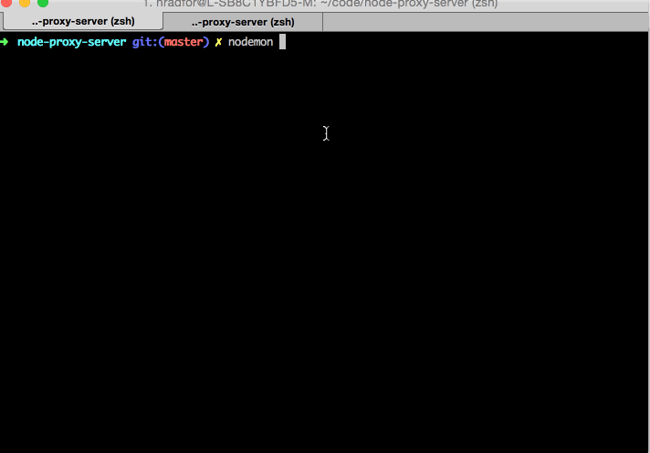

# Node Proxy Server

> Created for Codepath node.js course.



## CLI

To start the proxy server:

```bash
$ babel-node index.js
```

### Options

To start the server with options, separate the script and the option
flags with an extra `--`.

#### `host`
```bash
$ babel-node index.js -- --host google.com
```

#### `logfile`
```bash
$ babel-node index.js -- --logfile .tmp/log.log
```

#### `port`
```bash
$ babel-node index.js -- --port 9091
```

#### `url`
```bash
$ babel-node index.js -- --url http://google.com:9091
```

## Using the Proxy Server

```bash
# Echo Server
curl -v "http://localhost:8001" -d "This default host will echo whatever you send it".

# Proxying request on a per-request basis
# Pass the destination through as the "x-destination-url" header.
curl -v "http://localhost:8001" -H "x-destination-url: http://google.com"
```
